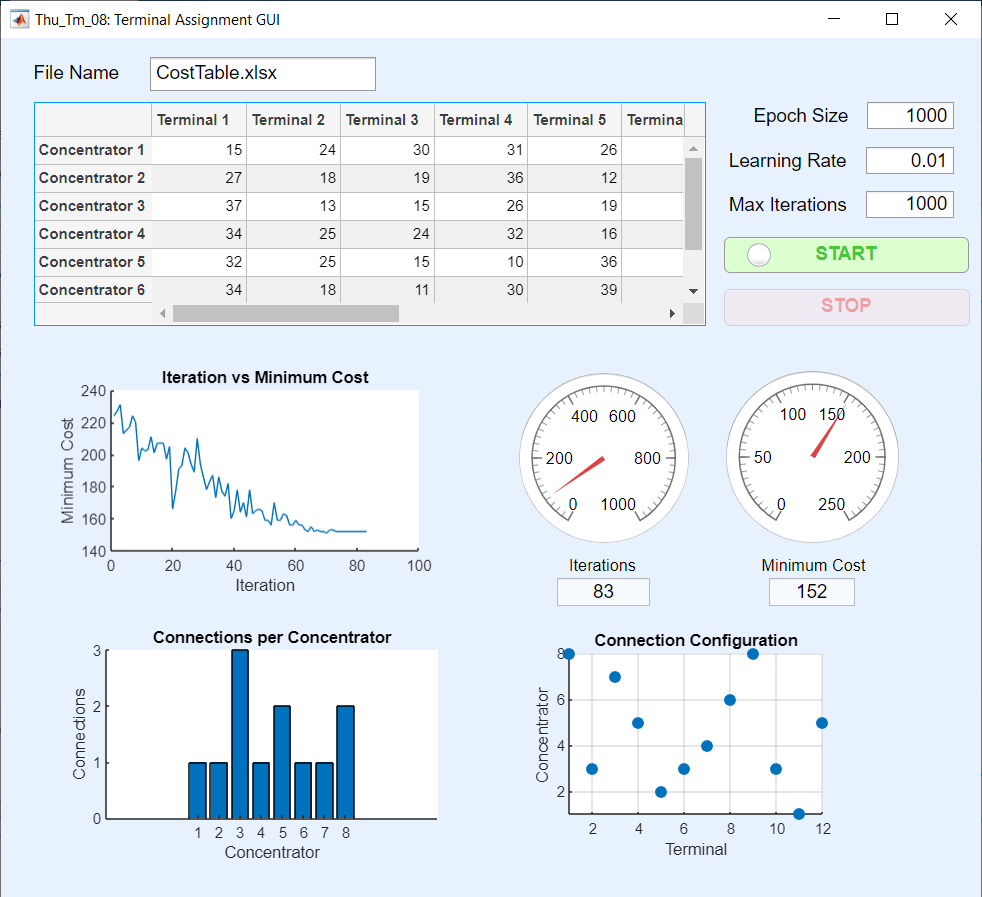

# Terminal Assignment Program

## Overview

A terminal assignment problem is where various terminals and various concentrators can connect at a certain associated cost but an optimal solution is required to either minimise or maximise the cost (in this case, minimise).

The program, coded in MATLAB, performs Population Based Incremental Learning (PBIL), an iterative algorithm that uses competitive learning techniques in order to optimise solutions.

The algorithm works by generating various trial solutions that describe which terminals are connected to which concentrators. After generating a certain number of solutions in an Epoch, the best solution is used to modify the Probability Vector, which in turn influences which connections may or may not appear in future trials. This is done until either the Probability Vector consists of 1’s and 0’s, or the maximum amount of Epochs have been reached.

## The GUI

MATLAB App Designer was also used to create a GUI for the MATLAB code to provide a visual representation of the PBIL algorithm, alongside satisfying the following requirements:
* Input a cost table as an excel file (location relative to source file), learning rate and epoch size
* Calculating the number of terminals and concentrators from a cost table
* Allowing experimentation with learning rate and epoch size
* Display progression to minimum cost, allocation distribution of terminals to concentrators & final configuration and minimum cost

Here's an example of one optimal solution obtained:

Here's an example of another optimal solution obtained (with 10x more trials in an epoch):

